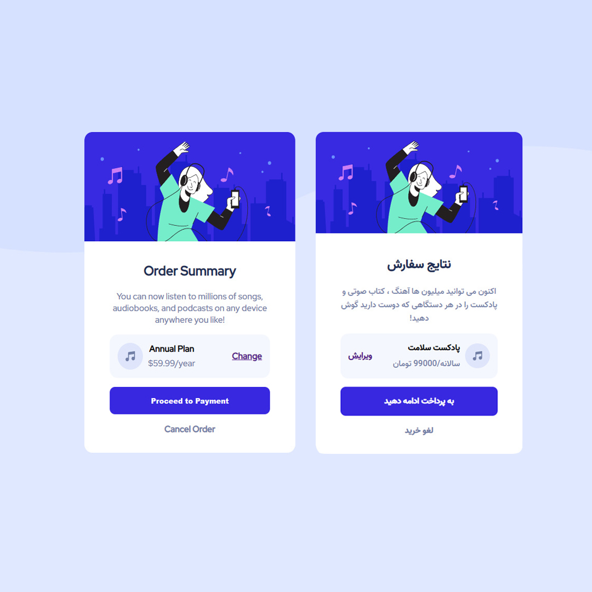

# Order summary card solution

## Table of contents

- [Overview](#overview)
  - [The challenge](#the-challenge)
  - [Screenshot](#screenshot)
  - [Links](#links)
- [My process](#my-process)
  - [Built with](#built-with)
  - [What I learned](#what-i-learned)

## Overview

### The challenge

Users should be able to:

- See hover states for interactive elements

### Screenshot



### Links

- Solution URL: [Add solution URL here](https://github.com/MiladRostami01/Order-summary-card)
- Live Site URL: [Add live site URL here](https://order-summary-card-pi.vercel.app/)

## My process

### Built with

- HTML5 markup
- CSS custom properties
- Flexbox
- CSS Grid
- desktop-first workflow
- [Sass](https://sass-lang.com/) - Sass

### What I learned

This is good challeng for you if you want to learn how to create card 

To see how you can add code snippets, see below:

```html
  <div class="card">
    
    <div class="content">
      <h2>نتایج سفارش</h2>
      <p class="discribtion">اکنون می توانید میلیون ها آهنگ ، کتاب صوتی و پادکست را در هر دستگاهی که دوست دارید گوش دهید!</p>
      <div class="song">
        <div class="song-info">
          <svg xmlns="http://www.w3.org/2000/svg" width="48" height="48"><g fill="none" fill-rule="evenodd"><circle cx="24" cy="24" r="24" fill="#DFE6FB"/><path fill="#717FA6" fill-rule="nonzero" d="M32.574 15.198a.81.81 0 00-.646-.19L20.581 16.63a.81.81 0 00-.696.803V26.934a3.232 3.232 0 00-1.632-.44A3.257 3.257 0 0015 29.747 3.257 3.257 0 0018.253 33a3.257 3.257 0 003.253-3.253v-8.37l9.726-1.39v5.327a3.232 3.232 0 00-1.631-.441 3.257 3.257 0 00-3.254 3.253 3.257 3.257 0 003.254 3.253 3.257 3.257 0 003.253-3.253V15.81a.81.81 0 00-.28-.613z"/></g></svg>
          <div>
            <h5>پادکست سلامت</h5>
            <p>سالانه/99000 تومان</p>
          </div>
        </div>
        <a class="song-change" href="#">ویرایش</a>
      </div>
      <button>به پرداخت ادامه دهید</button>
      <a class="cancel" href="#">لغو خرید</a>
    </div>
  </div>
```
```scss
 button{
    background-color: $bright-blue;
    margin-bottom: $mb-1;
    color: $white;
    font-size: $text-size;
    border-radius: 10px;
    width: 100%;
    padding: 15px;
    font-weight: 900;
    border: none;
    cursor: pointer;

    &:hover{
      background-color: $hover;
    }

  }
```


### Frontend Mentor 
  This is a solution to the [Order summary card challenge on Frontend Mentor](https://www.frontendmentor.io/challenges/order-summary-component-QlPmajDUj). Frontend Mentor challenges help you improve your coding skills by building realistic projects. 
